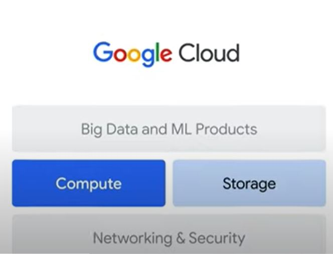
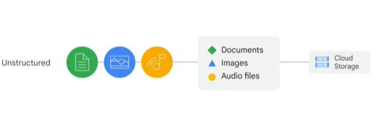
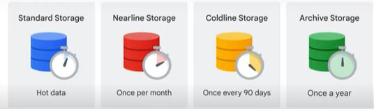
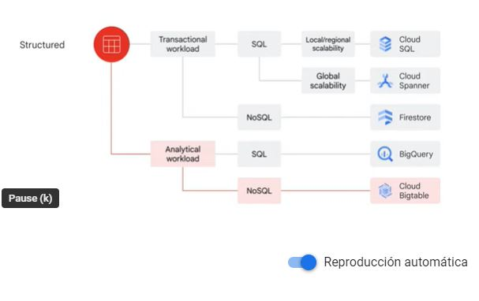
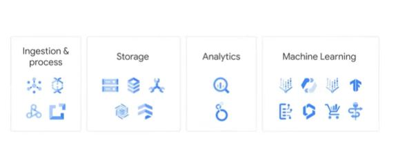

# Big Data y Machine Learning en Google Cloud

- Compute 
- Store
- The history of big data and ML products
- Big data and ML product categories
- Customer example

## Cómputo
Las organizaciones necesitan datos crecientes a menudo requieren mucha potencia de cómputo para ejecutar trabajos de big data. A medida que las organizaciones diseñan para el futuro, la necesidad de poder de cómputo solo crece por lo que Google ofrece una gama de servicios informáticos.

El primero es *Compute Engine* que proporciona:
- Iaas o infraestructura como servicio
- Cómputo
- Almacenamiento
- Recursos de red virtualmente similares a los centros de datos físicos.
- Máxima flexibilidad

Utiliza los recursos informáticos y de almacenamiento virtuales de la misma manera que los administra localmente, brinda una máxima flexibilidad para aquellos que prefieren administrar instancias de servidor ellos mismos.

## Kubernetes
Ejecuta aplicaciones en contenedores en un entorno de nube, a diferencia de una máquina virtual individual, como *Compute Engine* un contenedor representa el código empaquetado con todas sus dependencias.

- Aplicaciones en contenedores
- Entorno en nube 

## App Engine
Es una oferta de PaaS totalmente gestionada o plataforma como servicio. Las PaaS vinculan el código a las bibliotecas que brindan acceso a la aplicación de infraestructuras. Esto permite concentrar más recursos en la lógica de la aplicación. 

## Cloud Functions
Ejecuta código en respuesta de eventos como cuando se carga un nuevo archivo en Cloud Storage, es un entorno de ejecución completamente sin servidor lo que significa que no se necesita instalar ningún software localmente para ejecutar el código y no tiene un aprovisionamiento ni administrar servidores 

## Cloud Run
Plataforma informática completamente administrada que le permite ejecutar cargas de trabajo sin estar basados en solicitudes o eventos sin tener que preocuparse por los servidores. Abstrae toda la información de la infraestructura para que pueda concentrarse en escribir código.

# Storage
Con la computación en la nube las limitaciones de procesamiento no están vinculadas a los discord de almacenamiento. La mayoria de aplicaciones solo necesitan una base de datos y una solución de almacenamiento de algún tipo. Con Compute Engine puede instalar y ejecutar una base de datos en una máquina virtual. 
Adicionalmente Google Cloud ofrece servicios de almacenamiento y bases de datos totalmente administrados estos incluyen almacenamineto en la nube.

Google Cloud ofrece:
- Bases de datos relacionales y no relacionales
- Alacenamiento de objetos en todo el mundo

## Datos no estructurados
Son información almacenada en un formato no tabular como documentos, imágenes y archivos de audio. Suelen ser adecuados para el almacenamiento en la nube pero BigQuery ahora también ofrece la capacidad de almacenar datos no estructurados. Cloud Storage es un servicio administrado para almacenar datos no estructurados

Cloud storage es un servicio para almacenar un objeto en Google Cloud. Un objeto es un dato inmutable que consta de un archivo de cualquier formato. Almacena objetos en contenedores llamados buckets.

Cloud storage tiene 4 clases de almacenamiento:

Alternativamente existen datos estructurados, que representan información almacenada en tablas, filas y columnas.
Los datos estructurados vienen en 2 tipos:
- Transactional Workload
- Analytical Workload

## Transactional Workload
Los transaccionales provienen de sistemas de procesamiento de transacciones en líneas que se utilizan cuando son rápidos.
- Requieren consultas relativamente estandarizadas que afectan solo a unos pocos registros.
- Suele ser usada para mantener una instantánea del sistema.

## Analytical Workload
Derivan de los sistemas de procesamiento analítico en línea, que se utilizan cuando es necesario leer conjuntos de datos completos ya que requieren consultas complejas

una vez identificados que tipo de datos son necesita saber si utilizara SQL o NO SQL

Si sus datos son transaccionale sy necesita acceder a ellos mediante SQL entonces Cloud SQL y Cloud Spanner son 2 opciones.

Cloud SQL funciona mejor para escalabilidad local a regional mientras que Cloud Spanner funciona mejor para escalar globalmente. Si accedera sin SQL Firestore podria ser la mejora opción ya que es una base de datos transaccional No SQL orientada a documentos.

Si la carga de trabajo es analítica requiere comandos SQL, BigQuery es la mejor opción le permite analizar conjuntos de datos a escala petabytes. Cloud Bigtable proporciona una solución NoSQL escalable para cargas de trabajo analíticas. Es mejor para aplicaciones de alto rendimiento en tiempo real que requieren solo milisegundos.

# Big data and ML product categories

## Ingesta
Incluye productos que se utilizan para alimentar datos en tiempo real y por lotes.
La lista incluye Pub/Sub Dataflow, Dataproc, Cloud Data Fusion.

## Storage
Existen 5 productos de almacenamiento de datos:
- Cloud Storage
- Cloud SQL (SQL)
- Cloud Spanner (SQL)
- Cloud Bigtable (NOSQL)
- Firestore  (NOSQL)

## Analytics
La principal herramienta es BigQuery se puede usar para analizar datos a través de SQL.
Además BigQuery puede analizar y visualizar resultados mediantes: Looker y Looker Studio.

# Machine Learning
Incluye tanto la plataforma de desarrollo de ML como las soluciones de IA. El principal producto de la plataforma de desarrollo de ML es *Vertex AI*, que incluye los productos y tecnologías:
- AutoML 
- Vertex AI Workbench
- Tensorflow

Ai solutions incluyen:
- Document AI
- Contact Center AI
- Retail Product Discovery
- Helthcare Data Engine

