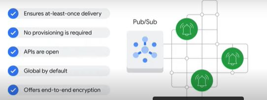
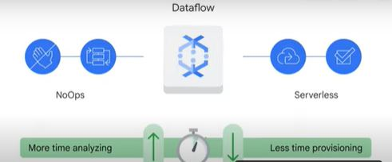
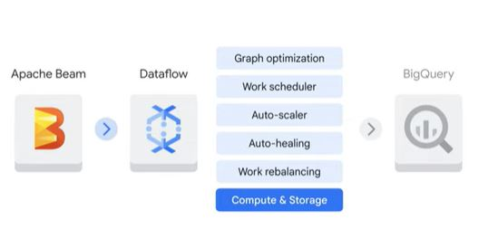

# Message - oriented architecture
Una de las primeras etapas de una canalización de datos es la ingesta de datos donde se reciben grandes cantidades de datos de transmisión. Es posible que todos los datos no provengan de un mismo origen.
Los dispositivos de IOT presentan nuevos desafíos para la ingesta de datos que se puede resumir en:

- Datos puden ser transmitidos de diferentes métodos y dispositivos diferentes y puede no estar relacionados entre si pudiendo enviar información incorrecta o retrasada.
- Puede ser dificil distribuir eventos a los suscriptores correctos, se necesita un método para recopilar los mensajes de transmisión que provienen de diferentes sensores de Iot y transmitir a los suscriptores.
- Los datos puede llegar rápidamente y en grandes volúmenes.
- Asegurar que los servicios sean confiables, seguros y que funcionen como se espera.

Google Cloud es una herramienta para manejar arquitecturas distribuidas orientadas a mensajes a escala, y es *Pub/Sub* la abreviación de publicador y suscriptores debido a que es un servicio de mensajeria distribuida que puede recibir mensajes de una variedad de flujos de dispositivos.

# Implementing straming pipelines on cloud dataflow
Apache Beam se puede usar para crear pipelines de streaming de datos lo siguiente es identificar un motor de ejecución para implementar esos pipelines.

## Dataflow
Dataflow es un servicio completamente administrado para ejecutar pipelines de Apache Beam dentro de Google Cloud. Maneja gran parte de la complejidad relacionada con la configuración y mantenimiento de la infraestructura y se basa en la ingraestructura de Google. Permite un escalamiento automático confiable para satisfacer las demandas de canalización de datos.

Es Serverless y NoOps lo que significa que no hay operaciones, Un entorno NoOps es aquel que no requiere la gestión de un equipo de operaciones por que el mantenimiento y la supervisión y el escalado están automatizados.

El uso de plantillas de Dataflow, que cubren casos de uso comunes en los productos de Google Cloud. La lista de plantillas crece continuamente y se puede dividir en 3 categorías:

- Plantillas de streaming
- Plantillas por Batch
- Plantillas de utilidad

## Plantillas de streaming
Son para procesar datos continuos en tiempo real Por ejemplo:
- Pub/sub a BigQuery
- Pub/sub a Cloud storage
- Datastream a BigQuery
-  Pud/Sub a mongodb

## Plantillas por batch
Son para procesar datos masivos o datos de carga por batch
- BigQuery a Cloud Storage
- BigTable a Cloud Storage
- Cloud Storage a BigQuery
- Cloud Spanner a Cloud Storage

## Plantillas de utilidad
Abordan actividades relacionadas con la compresion masiva, la eliminación y converción