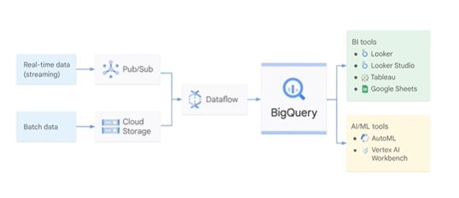
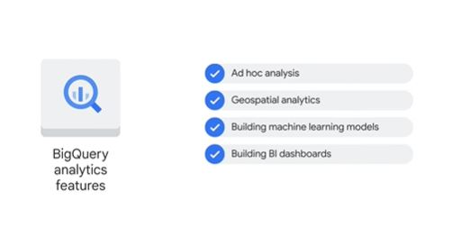

# Introduction
BigQuery is a fully managed data warehouse.
Un warehouse es un gran depósito, que contiene terabytes y petabytes de datos recogidos de una amplia gama de fuentes dentro de una organización, y que se utiliza para orientar las decisiones de gestión.

la principal diferencia entre un data warehouse y un data lake radica en la estructura y el enfoque de almacenamiento de datos. Los data warehouses son ideales para el análisis de negocios y generación de informes, mientras que los data lakes son más adecuados para almacenar grandes volúmenes de datos no procesados y permitir análisis avanzados y exploratorios. En muchos casos, ambas soluciones pueden complementarse en una arquitectura de datos más amplia y eficiente.

## Características de BigQuery
BigQuery brinda 2 servicios en uno: Storage y Analytics 
También es serverless solution, significa que no necesita preocuparse por recursos.
Los datos de BigQuery ya se encuentran encriptados por default.
El input de data puede ser real-time o batch data. Si es batch data será subida al Cloud Storage.
Si es Real-time va a PUB/SUB, luego ambos pipelines van a DataFLow a procesar la data.
Ahí realiza el ETL. Luego entra Big Query que envia a 2 buckets

# Storage and Analytics
BigQuery brinda 2 servicios en uno, se trata tanto de almacenamiento totalmente gestionada para cargar y almacenar datasets, con un motor de SQL conectados por redes de alta velocidad de Google que permite a BigQuery escalar en computo y almacenamiento dependiendo de la demanda.

Puede ingestar data de gran variada incluida data interna guardada directamente en BigQuery o externa de multi-cloud data y públicos datasets.

BigQuery también ofrece la posibilidad de consultar fuentes de datos externas almacenados en otros servicios de nube de Google como Cloud Storage, o en otros servicios de bases de datos de Google como Spanner o Cloud SQL y eludir el almacenamiento gestionado por BigQuery. Esto significa que se puede utilizar un archivo CSV sin procesar en Cloud Storage o en una hoja de Google para escribir una consulta sin que BigQuery lo ingeste primero.
Nota: La incoherencia podría resultar de guardar y procesar los datos por separado, para evitar esto se requiere el uso de DataFlow para construir una canalización de datos en BigQuery

# BigQuery key commands
*Create or replace model* : Crea o reemplaza un modelo 
*ML.WEIGHTS*: Genera valores de -1 a 1 según la importancia del feature.
*ML.EVALUATE*: Evalua el performance de un modelo.
*ML.PREDICT*: Genera predicciones.

